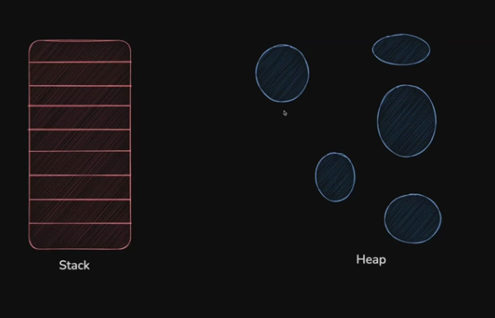
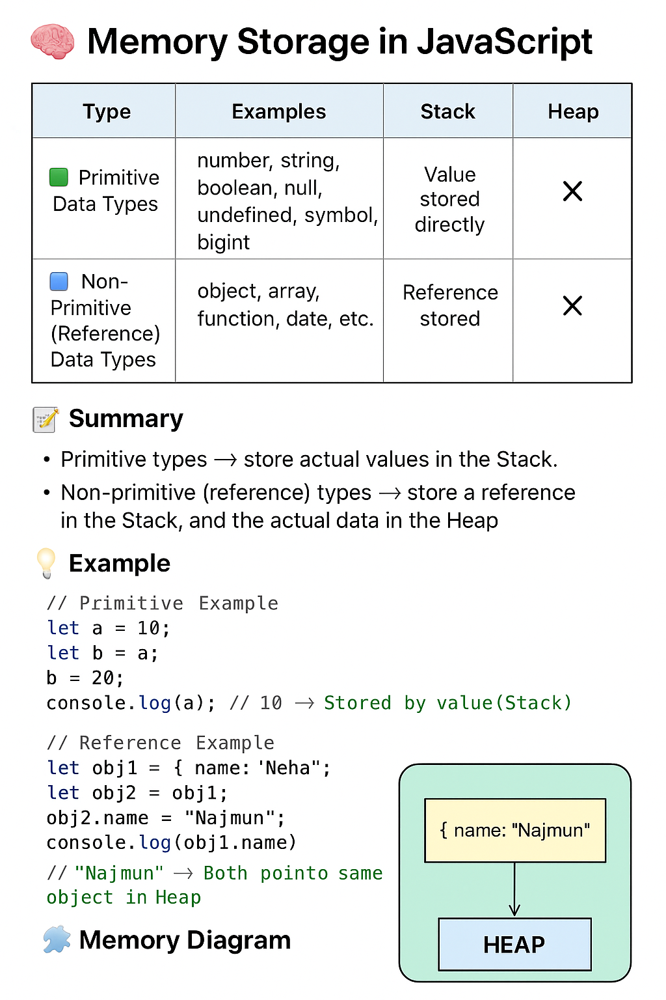
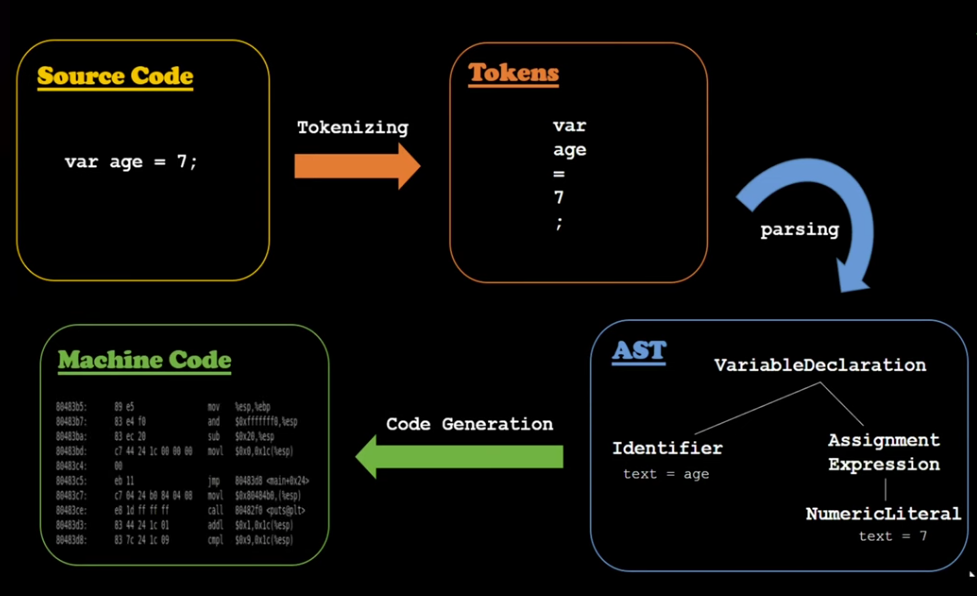

# Day 02

Topic - Variable and Data Types in JavaScript

Here’s a diagram to show Data type memory storage pointer 👇

📝 Summary

Primitive types store their actual values in the Stack.
Non-primitive (reference) types store a reference in the Stack, and the actual data in the Heap.

# How JavaScript see any line of code ?

1. Tokenizing
2. Parsing
3. Interpreting
4. Code Generation

JS Grammer flow diagram has given below

